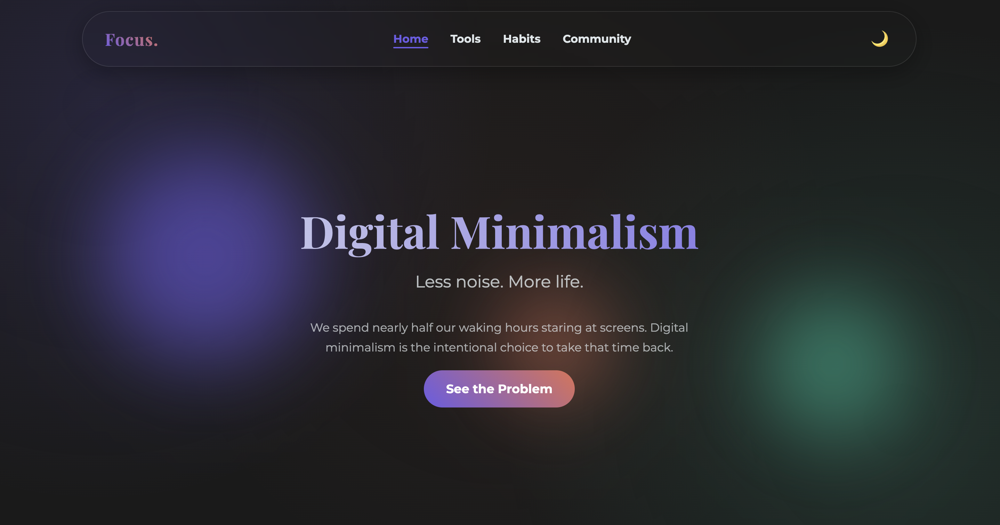

<div align="center">



# Focus.

### *Less noise. More life.*

A beautifully crafted, static website exploring the philosophy and practice of **digital minimalism** — the intentional choice to reclaim your time and attention from an always-on, always-demanding digital world.

---

[](https://developer.mozilla.org/en-US/docs/Web/HTML)
[](https://developer.mozilla.org/en-US/docs/Web/CSS)
[](https://developer.mozilla.org/en-US/docs/Web/JavaScript)
[](package.json)
[](https://www.w3.org/WAI/standards-guidelines/wcag/)

</div>

---

## The Premise

> *"Digital minimalism definitively does not reject the innovations of the internet age, but instead rejects the way so many people currently engage with these tools."*
> — **Cal Newport**

The average person spends **7 hours a day** staring at a screen — nearly **44% of their waking life**. Across a lifetime, that adds up to over **13 years**. This site makes the case that it doesn't have to be that way.

**Focus.** is a static, zero-dependency website that presents the philosophy, daily practices, tools, and community resources for living more intentionally with technology.

---

## Pages

| Page | Path | Description |
|---|---|---|
| **Home** | `index.html` | The core argument — statistics, philosophy, and the three-step path forward |
| **Tools** | `tools.html` | Curated dumbphones and focus apps for reducing digital noise |
| **Habits** | `habits.html` | Daily practices and the structured 30-day digital declutter |
| **Community** | `community.html` | Recommended books, online communities, and thinkers |

---

## Features

### Design
- **Dual theme** — Light and dark mode with a single toggle, persisted across sessions via `localStorage`
- **Responsive layout** — Mobile-first design with a smooth hamburger navigation for small screens
- **Subtle motion** — Scroll-triggered animations and interactive card tilt effects that respect `prefers-reduced-motion`
- **Typography** — Playfair Display for headings, Montserrat for body — a pairing built for calm, intentional reading

### Interactivity
- **Animated counters** — Statistics count up into view as the user scrolls, driven by `IntersectionObserver`
- **Animated donut chart** — A CSS-driven SVG chart illustrating screen time as a percentage of waking hours
- **Interactive step checklist** — The 30-day declutter steps can be marked complete, with state saved to `localStorage`
- **Back-to-top button** — Appears on scroll and smoothly returns the user to the top of the page

### Performance & Reliability
- **`transitionend`-based cleanup** — Navigation animation lifecycle is synchronized with the actual CSS transition via the `transitionend` event, not a fragile `setTimeout`. This ensures precise timing regardless of system load. See [`PERFORMANCE_IMPACT.md`](PERFORMANCE_IMPACT.md) for the full write-up.
- **No JavaScript frameworks** — Vanilla JS with no build step and no bundler required
- **Deferred script loading** — `script.js` uses `defer` to avoid blocking page render
- **Content Security Policy** — A strict CSP header is set on every page, limiting asset sources to `'self'` and trusted font providers

### Accessibility
- **Skip-to-content link** — Allows keyboard users to bypass repeated navigation
- **Semantic HTML** — Proper use of `<main>`, `<header>`, `<footer>`, `<nav>`, `<section>`, `<blockquote>`, and `<cite>`
- **ARIA attributes** — Navigation toggle uses `aria-expanded`, `aria-controls`, and `aria-label`; the donut chart has a descriptive `aria-label` for screen readers
- **Focus management** — Page sections targeted by in-page links receive `tabindex="-1"` so focus is moved correctly

---

## Project Structure

```
less/
├── index.html          # Home — the problem and the philosophy
├── tools.html          # Dumbphones and focus applications
├── habits.html         # Daily habits and 30-day declutter
├── community.html      # Books, communities, and thinkers
├── style.css           # All styles — layout, themes, animations
├── script.js           # All interactivity — no framework required
├── favicon.svg         # SVG favicon
├── verification_hero.png
└── PERFORMANCE_IMPACT.md  # Write-up on the transitionend optimization
```

---

## Getting Started

No build tools. No package manager. No setup.

```bash
git clone <repo-url>
cd less
# Open in your browser
open index.html
```

Or serve it locally for a more accurate environment:

```bash
# Python
python3 -m http.server 8080

# Node.js
npx serve .
```

Then visit `http://localhost:8080`.

---

## Philosophy

The site is built to embody the values it describes. Three principles guided every decision:

**1. Clutter is Costly**
No npm installs. No bundlers. No trackers. No ads. No external analytics. The only third-party resource is a Google Fonts stylesheet — a deliberate, bounded choice.

**2. Optimization is Important**
Every interactive feature is built on browser-native APIs: `IntersectionObserver`, `transitionend`, `localStorage`, `requestAnimationFrame`. The result is a site that loads instantly and runs smoothly on any device.

**3. Intentionality is Satisfying**
Every element earns its place. If something didn't serve the reader's understanding or experience, it was left out.

---

## Recommended Reading

The ideas on this site draw from a body of work worth exploring:

- **[Digital Minimalism](https://calnewport.com/writing/#digital-minimalism)** — Cal Newport
- **[Deep Work](https://calnewport.com/writing/#deep-work)** — Cal Newport
- **[The Shallows](https://www.nicholascarr.com/?page_id=16)** — Nicholas Carr

---

<div align="center">

*Built with Focus.*

&copy; 2026 Digital Minimalism Concept

</div>
